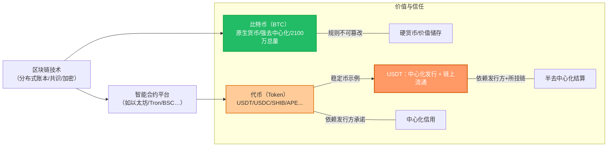

# 区块链的真相：除了比特币，其实都没那么“去中心化”

这几年，“区块链”几乎被神化了。无论是金融科技圈还是朋友圈，大家都在说：区块链能改变一切，代币就是未来。可真相真的是这样吗？

让我们把几个关键问题捋清楚：

---

## 1. 区块链技术的态度：唯一靠谱的就是比特币

Saifedean Ammous 在《The Bitcoin Standard》里的观点：  
区块链并不是一个“万能技术”，它唯一的价值，就是支撑比特币的去中心化货币体系。 中文译本《货币未来：从金本位到区块链》这个翻译有很强的误导性，让人以为区块链技术是货币的未来。

- 除了比特币，大多数所谓“区块链+”应用（供应链、医疗、投票…）并不需要去中心化账本，传统数据库效率更高、成本更低。  
- **结论**：区块链本质上不是一剂万能药，它的唯一硬核价值，就是让比特币存在。

---

## 2. 代币的本质：中心化信用 + 半去中心化结算

**代币 ≠ 币**

- **币（coin）**：某条链的原生货币，比如比特币、以太坊。  
- **代币（token）**：依赖某条链发行的资产，比如 USDT、SHIB、APE。  

**稳定币（USDT、USDC 等）的逻辑：**

- 背后有中心化公司（Tether、Circle）承诺 1:1 兑换美元。  
- 流通依赖区块链转账，但区块链本身并不完全去中心化。  

**为什么转账便宜？**  
因为它用“一条链的统一账本”替代了银行体系的多层清算。用户只需要链上确认一次，而不用经过 SWIFT、清算所、央行多层级对账。 

---

## 3. 节点是谁控制的？并不是真正的分布式

- **以太坊**：节点多，分布广，但矿池/质押节点仍有集中化趋势。  
- **Tron**：USDT 的大本营，但出块节点只有 27 个超级代表，明显中心化。  
- **BSC（币安智能链）**：21 个节点，几乎被币安集团主导。  
- **Solana、Polygon 等**：节点数有限，基金会和大机构影响力极大。  

👉 也就是说，绝大多数代币所在的链，其实只是“半去中心化”。

---

## 4. 为什么大家还是用？

- **比传统银行更便宜、更快**：跨境转账几十秒完成，手续费几毛钱，远低于 SWIFT。  
- **透明度高**：交易上链，公开可查，比银行黑箱透明得多。  
- **“足够去中心化”就够了**：对普通用户来说，核心诉求是效率和自由，而不是绝对的去中心化。  

---

## 5. 唯一真正去中心化的：比特币

- **没有中心化公司**：比特币没有 CEO，没有基金会，没有谁能随意增发。  
- **节点分布全球**：任何人都可以跑节点，记账权由算力竞争决定。  
- **货币规则不可篡改**：2100 万枚的总量，是写死在协议里的。  

所以，从严格意义上说，**只有比特币是真正去中心化的货币系统**。  

---

## ✨ 总结一句话

**区块链 ≠ 万能，代币 ≠ 去中心化。**  
稳定币和山寨链是务实的金融工具，但它们依旧依赖中心化信用和有限分布的节点。  
**唯有比特币，才是真正意义上不可篡改、去中心化的货币革命。**

