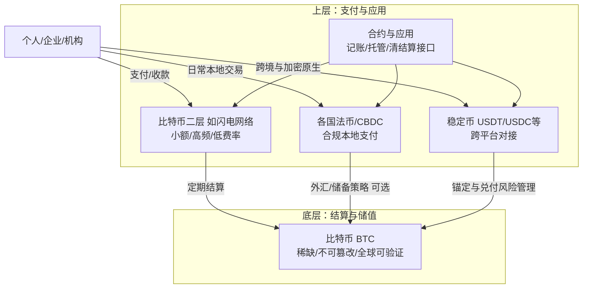

# 《比特币标准》中的未来推演

根据 Saifedean Ammous 的观点，《The Bitcoin Standard: The Decentralized Alternative to Central Banking》对未来货币和社会发展的走向有以下判断：

---

## 1. 法币体系的长期衰落
- **原因**：央行无限量印钞、通胀侵蚀储蓄、货币政治化。  
- **结果**：法币越来越难维持人们对“稳定”的信任。  
- **趋势**：人们会逐渐意识到，持有现金等于被隐形征税，从而主动寻找替代资产。

---

## 2. 比特币可能成为全球的“硬货币标准”
- 稀缺性：总量 2100 万枚，无法随意增发。  
- 不可篡改：全球分布式账本，确保规则稳定。  
- **定位**：  
  - **日常交易** → 依旧可能用各国本地货币或比特币二层方案（如闪电网络）。  
  - **大额结算/储值** → 比特币逐渐成为主流选择。  

---

## 3. 人类社会的“低时间偏好”转型
- **现状**：通胀环境下，人们追求及时行乐，消费大于储蓄。  
- **未来**：比特币的抗通胀属性，鼓励人们延迟满足、重视长期规划。  
- **社会后果**：更多资本积累，推动科学、教育、基础设施等长期发展。

---

## 4. 黄金的角色被数字化替代
- 黄金：历史上最佳“硬货币”，但难以流通、难以验证。  
- 比特币：同时具备稀缺性 + 高流动性 + 易验证。  
- **推演**：比特币在数字经济时代取代黄金，成为“数字黄金”。

---

## 5. 未来货币格局：双层体系
- **底层结算货币**：比特币，类似“数字化金本位”。  
- **上层支付体系**：各国货币、稳定币或比特币二层网络，用于日常支付。  
- **类比**：就像互联网的 TCP/IP 协议，比特币可能成为未来货币体系的底层共识协议。

---

## ✨ 总结一句话
**未来的货币体系可能会从央行主导的法币时代，逐渐转向以比特币为基础的“去中心化硬货币标准”，推动人类进入一个储蓄、长期规划与稳定发展的新阶段。**

## 开放性问题

看完这本书之后我相信比特币会有极大的可能性成为数字黄金，但是问题在于好像没有办法让每个人都拥有比特币，当然这个问题是个伪命题，因为就像不可能每个人都有存款和黄金一样，比特币并不是来解决这个问题的。
问题在于：如果比特币成为数字黄金，到后来国家央行真的储备它，进行跨境结算，大量财富的拥有者可以更好的储存价值和传递给下一代，普通人生活的世界到底会发生多大的改变？ 他们还是会处于法币体系下， 所有的生活收入和开销还是围绕着法币展开。所以这本书的结论说人类进入一个储蓄长期规划与稳定发展的新阶段，其实只是财富阶层可以做到，普罗大众并没有办法做到。

还有一个问题就是，如果财富存储更容易，代际传递更容易，那也会导致财富分化越来越严重，这个时候人类社会会如何继续发展呢？ 会再一次出现暴力革命吗？

还是说比特币真的成功之后，国家之间最后不用通过政治协商来决定汇率，而是自己的法币锚定比特币储备，国际贸易自由流通？ 但是这个好像比特币本书根本无法做到啊？关税和贸易壁垒并不会你换一个形式的货币就自然解决。

即使到最后，政府无法阻止比特币，他们拥抱比特币，他们也可以像之前发生的禁止个人持有黄金一样，宣布比特币非法，要大家上交和兑换法币，最后比特币的储备又像黄金一样被央行大部分拥有，但是这个情况应该不会发生的原因在于，如果政府真的这么做，那么他们拿到的只能是废纸了，因为比特币的价值就完全丧失了。
而且国家和政府之间会竞争，有的政府会支持，那不支持的政府其实就会蒙受损失，因为它无法禁止他的国民通过这个方式转移资产。那么，他就又会想办法参与竞争，加入这个网络，那也就是说所有的政府最后都认可，就像认可黄金一样，那会发生什么呢？ 其他拥有美元储备的国家会抛售美元，持有比特币，美元进一步贬值，比特币进一步升值。所以，美国政府的选择就是要么提前储备比特币，要么禁止它，导致其他国家继续抛弃美元，持有更多比特币或者 其他货币储备，现在已经有很多美元资金配置比特币资产，所以感觉美元是在走储备路线，虽然不是政府行为但是美元资本已经在布局和储备。那最终的形态会成为什么样呢？比特币会部分成为一些黄金储备，特别是如果局势不稳定，导致主流银行体系政治站队，就会催生比特币这种无中心分布式的兴旺。最近一轮比特币上涨，其实就是当下美国政府合法化比特币的结果，导致美元资本大量涌入，现在在11万刀的价格了。之后会如何发展？

## GPT重新我的开放问题疑问
以下先提炼原段的核心逻辑，再给出更清晰结构化的重写版本。

核心逻辑梳理

前提：比特币很可能进化为“数字黄金”并被国家/央行储备。
普惠性疑问：不可能人人都大量持有，比特币本身也非为“人人持有”而设计。
分配与阶层：若其成为储值资产，首先受益的是已有资产与认知优势的财富阶层，普通人仍深陷法币收入与支出循环。
结果质疑：书中描绘的“低时间偏好、长期规划”社会，可能只对财富阶层成立，未必普遍扩散。
不平等风险：跨代财富传递更顺畅 → 贫富差距可能加剧 → 是否触发社会/政治反作用（如再分配、征税、极端运动）成为开放问题。
国际货币机制：即便各国锚定比特币储备，传统贸易壁垒（关税、产业政策）不会因结算媒介变化自动消失。
政府策略博弈：
极端手段（类黄金禁令）理论上可尝试，但会因削弱市场信心而自毁价值。
国家间竞争与资本跨境可流动性，驱动迟缓国家被动跟进。
地缘与美元：若更多国家/资本迁移一部分储备至比特币，可能相对削弱美元的储备地位；美国的理性策略是在禁止与吸纳之间权衡。
可能终局（暂定）：混合储备体系（法币 + 黄金 + 比特币部分权重）；在政治或金融体系分裂加剧时，比特币弹性角色强化。
未决：价格演化路径与制度整合速度高度不确定。
重写版本（逻辑分层） 开放性思考：比特币若成“数字黄金”，普通人与全球货币结构会怎样演化？

起点假设
比特币具备进入国家或央行储备资产序列的潜力，逐步扮演跨境结算与抗贬值的价值存储载体。

普惠性与局限
它不需要、也不可能“人人大量持有”。和黄金、金融资产一样，初期获益主要集中在资本与认知优势阶层；大多数人的现金流仍在本国法币体系中循环。

书本愿景与现实落差
“社会整体进入低时间偏好、长期储蓄时代”的理想，可能在现实中先是阶层化：有剩余资产者转向长期配置，月光或低储蓄群体难以同步转型。

不平等与社会反馈
跨代财富保存成本下降 → 结构性加速财富固化 → 需要关注：是否引发再分配政策强化、监管加码，甚至在极端情况下触发周期性社会动荡。

国际货币与贸易结构
即使法币“部分锚定”比特币或以其作为最终结算层，传统贸易摩擦（关税、补贴、产业安全）并不会因结算介质改变而消解。换底层储值 ≠ 自动实现自由贸易。

政府策略与博弈路径

强制没收/禁令路径：理论上可复制黄金历史案例，但分布式可携性 + 市场预期崩塌风险，使其成本高、有效期短。
竞争驱动：一旦少数司法辖区开放并吸引资本，其它国家被动跟进以避免资本与人才流失。
结果：逐步形成“你不用它，但你要定价时承认它”的现实共识。
地缘金融与美元地位
若跨国储备组合中比特币权重上升，边际上削弱美元单极主导；美国理性策略是在压制（延缓他国优势）与提前吸纳（锁定主导权）之间权衡。市场数据（资本自发配置）显示：民间或机构美元资本已在“类预储备化”布局。

中期可能形态

储备篮子：黄金 + 比特币 + 外汇（美元 / 其它）
使用层：日常支付仍以法币/稳定币/二层网络为主
触发强化情景：银行体系地缘分裂、清算网络政治化、资产外逃需求增加。
不确定性与关键变量
价格路径、监管统一节奏、技术扩容（L2、托管安全）、税收处理方式、地缘冲突强度。

核心开放问题（供继续追踪）

贫富差距是否会在“更易储值”技术条件下进一步制度化？
各国会否发展出“比特币参与度指数”影响主权信用与资本流向？
税与合规层是否催生“半透明化”比特币使用模式，弱化其原初去中心化特征？
何种阈值（持仓比例 / 结算占比）标志其真正进入“战略储备资产”阶段？
一句浓缩版重写 比特币即便成为全球部分储备与结算层，其长期社会效应更可能是“阶层化的储值升级”与“地缘金融重新定价”，而非立即带来全民低时间偏好转型；真正的变量在于政策博弈、监管框架与不平等的社会反馈机制。
