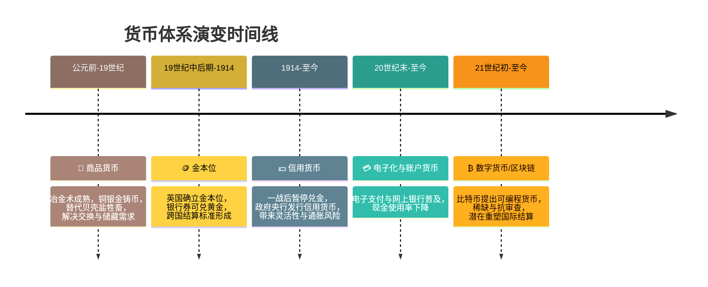

# 读书笔记｜《货币未来：从金本位到区块链》

## 一、纵览货币本质和发展史

从贝壳、盐、牲畜，到金银铜币；从金本位到信用货币；再到今天的电子化、区块链货币。货币的本质始终围绕三个关键词：**储藏价值、交换媒介、度量标准**。每一次转折都与技术进步、国家权力与社会信任的再分配有关。
### 货币体系演变主要时期与转折点

---

| **时期** | **时间轴** | **关键转折点** | **影响与意义** |
|----------|------------|----------------|----------------|
| **商品货币** | 公元前 — 19 世纪 | 冶金术成熟，铜、银、金被铸成规则钱币；贝壳、盐、牲畜等早期“一般等价物”逐渐被金属替代 | 解决了物物交换中的“度量”与“储藏”需求，但金属货币易被掺假，价值仍随供需波动 |
| **金本位** | 19 世纪中后期 — 1914 | 英国 1717 年确立现代金本位，随后欧洲多国跟进；银行券可随时兑付黄金，形成“黄金时代” | 提供了相对稳定的价值尺度与跨国结算标准，但也把货币发行束缚在黄金储备上 |
| **信用货币** | 1914 — 至今 | 一战爆发后，各国暂停纸币兑金，放弃金本位；央行凭信用发行不兑现纸币 | 政策更加灵活，可刺激增长，却带来通胀、资产泡沫及主权信用风险 |
| **电子化与账户货币** | 20 世纪末 — 至今 | 计算机与网络普及，电子支付与网上银行兴起，现金使用率持续下降 | 降低交易成本、提升支付效率，但价值仍依赖国家信用背书 |
| **数字货币 / 区块链** | 21 世纪初 — 至今 | 比特币等提出“可编程货币”，具稀缺与抗审查属性 | 若广泛采用，可能重塑国际结算与主权货币地位，但面临波动与监管挑战 |

---

### 主要转折点解析

1. **金属化**  
   冶金技术推动货币从“易腐商品”迈向“可分割、可携带”的金属币，奠定近代货币雏形。  

2. **金本位化**  
   银行券与通讯网络结合，使黄金集中于央行金库，实现跨国稳定结算，奠定国际金融体系基础。  

3. **信用化**  
   战争与危机迫使各国放弃黄金约束，货币供给由市场稀缺转向政府财政与央行政策决定，带来更大弹性与风险。  

4. **电子化**  
   信息技术革命使货币逐步“账户化”，物理现金让位于数字余额，提高效率但也加深了对金融体系的依赖。  

5. **去中心化**  
   区块链技术提出“自我主权”的数字资产，试图结合稀缺性与抗审查，可能开启“后主权”货币时代。  

---

📌 **总结**  
这条时间线展示了：货币始终在 **“可携带（交换媒介） — 可分割（度量标准） — 可信任（储藏价值）”** 三者之间寻求平衡，而每次转折都由 **技术突破** 与 **制度博弈** 共同驱动。

---

## 二、新的、有意思的 insights

* **经济危机的替罪羊**：大萧条并非金本位的问题，而是因战争时期货币超发后，政府想用战前汇率强行回归金本位，结果导致更深的衰退。
* **货币与战争**：健全货币的时代，战争潜力取决于税收；不健全货币的时代，战争潜力上限取决于印钞机的速度。
* **家庭与国家的力量对比**：代际继承减少，家庭力量被削弱，政府掌握无限资金后对个人生活的介入越来越深。
* **创新从“0到1”**：1914年前的健全货币时代，是“0到1”的创新爆发期；1914年后则更多是“1到多”的规模扩张。
* **文化与时间偏好**：低时间偏好的社会，往往孕育长远艺术与伟大作品；而通胀与货币贬值则推高时间偏好，带来短期主义与浮躁文化。

## 三、我的感受

读完最大的冲击是：**货币从来不是中性的，它塑造了整个社会的文化、家庭结构、甚至战争逻辑**。健全货币让人们更愿意延迟满足，储蓄与投资，推动文明；不健全货币则诱导消费、负债和短视，甚至成为战争的燃料。这让我重新理解了为什么“印钱”不是一个无害的技术操作，而是影响整个文明走向的变量。

## 四、我的行动

1. **个人层面**：降低时间偏好。减少不必要的即时消费，多储蓄、多投资，把资本留给未来。
2. **学习层面**：持续研究货币史和经济思想，理解货币背后的政治与社会逻辑。
3. **实践层面**：关注比特币和区块链的发展，思考它是否可能成为新的“健全货币”。
4. **生活态度**：不把责任推给所谓“命运”或“政策”，而是提升自己在货币游戏里的选择力。

---

👉 总结一句话：**货币不仅是经济的度量衡，它更是社会的价值观雕刻刀。**
